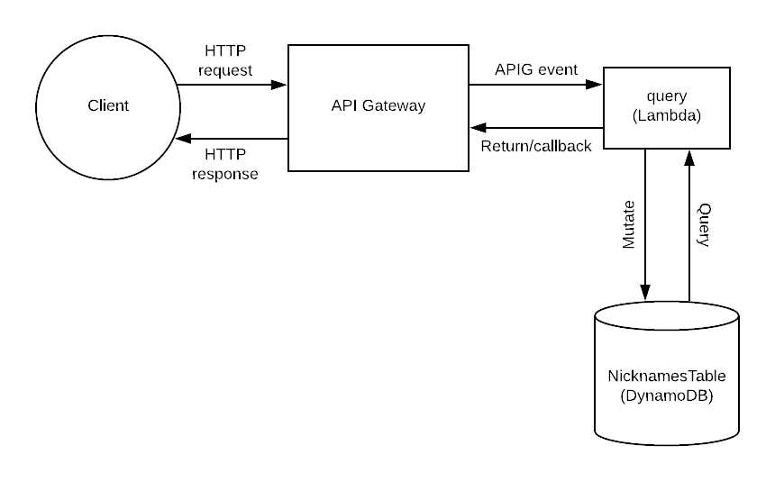

# AWS-Serverless-Projects
A collection of AWS Serverless Projects.

(Serverless framework)  
## Project 1
This code contains a Node.js project that returns 'Hello World'
## Project 2
This code contains a Python project that tests the effect of varying the timeout and memory of a lambda function. 
## Project 3
This code contains a Python project that performs lambda lookups using Boto3 with appropriate IAM permissions.
## Project 4
This code contains a Python project that returns a list of service-wide envrionment variables.
## Project 5
This code contains a Python project that invokes a lambda function inside a virtual private cloud.  

(AWS SAM framework)  
## Project 6
This code contains a Hello World API built with AWS SAM CLI. 
## Project 7
This code contains a Hello World API built with AWS SAM and AWS Toolkit in VS code.

## Project 8
This code contains a a simplistic version of an API that might be used by the front-end to retrieve a dynamic message to display in the UI; in this case, greeting the user by name ([source](https://www.serverless.com/blog/make-serverless-graphql-api-using-lambda-dynamodb/)).

